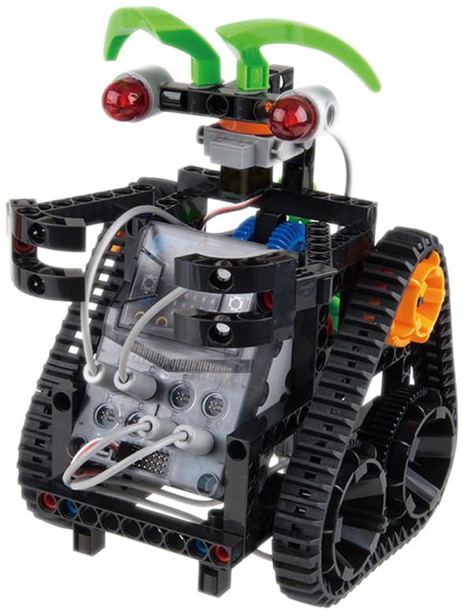
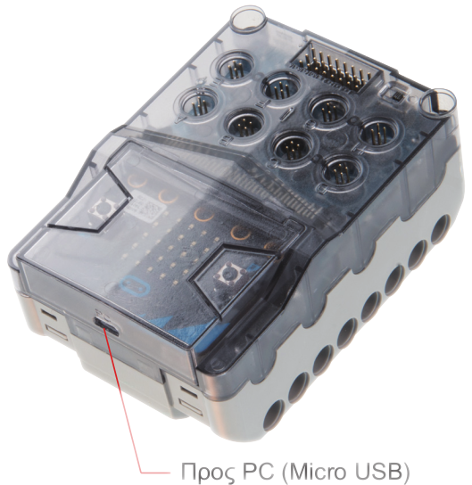
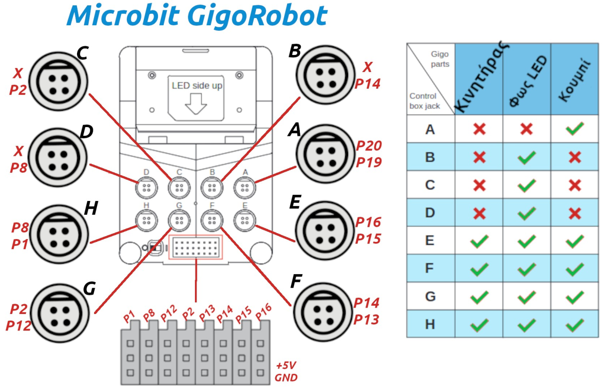

# Gigo Robot - MindPlus Extension (offline mode)

Το έργο αυτό είναι είναι extension για την εφαρμογή [Mind+](https://mindplus.cc/) το οποίο "μαζεύει" σε ένα σετ εντολών όλες τις λειτουργίες του κιτ που εναλλακτικά θα απαιτούσαν πολλά πρόσθετα για να λειτουργήσουν. 

Σκοπός του extension είναι να "κρυφτεί" η πολυπλοκότητα της διαδικασίας ενσωμάτωσης διαφορετικών βιβλιοθηκών Arduino C ώστε να λειτουργήσουν όλα τα πρόσθετα που περιέχει το κιτ. Για παράδειγμα ο αισθητήρας θερμοκρασίας βασίζεται στο DHT11 και υποστηρίζεται ήδη από βιβλιοθήκες ενσωματωμένες στο Mind+. Με το πρόσθετο αυτό όμως αρκεί να γίνει μια μόνο ενσωμάτωση ώστε να λειτουργούν όσο το δυνατόν περισσότεροι αισθητήρες και ενεργοποιητές του κιτ.

---------------------------------------------------------

## Τι είναι το Gigo Robot

Το Gigo Robot είναι ένα κιτ ρομποτικής που βασίζεται στο Microbit.

Τα κιτ αυτά χορηγήθηκαν σε επιλεγμένα (όχι σε όλα) Δημοτικά Σχολεία της χώρας στα πλαίσια του προγράμματος ανάπτυξης και αλληλεγγύης της αυτοδιοίκησης με το συμβολικό όνομα «Αντώνης Τρίτσης». Το έργο υλοποίησε ο Δήμος Τρικκαίων

## Ελεγκτής 

Το κιτ αυτό βασίζεται στον ελεγκτή BBC Microbit, και περιλαμβάνει ένα πλαστικό κουτί ελέγχου (control box) μέσα στο οποίο τοποθετείται. Το κουτί αυτό έχει ανεξάρτητες υποδοχές για σύνδεση των περιφερειακών του κιτ (κινητήρες και ενεργοποιητές).

## Πίνακας με υποστηριζόμενους αισθητήρες / ενεργοποιητές του κιτ

| Αισθητήρες / Ενεργοποιητές | Κατάσταση υποστήριξης | Σχόλια |
| --- | --- | --- |
| Κινητήρες | **Υποστηρίζεται** | --- |
| Σέρβο κινητήρας | **Υποστηρίζεται** | Χρήση βιβλιοθήκης DFRobot_Servo.h |
| Κουμπί πίεσης - αισθητήρας επαφής | **Υποστηρίζεται** | --- |
| Leds | **Υποστηρίζεται** | --- | 
| Αισθητήρες αντανάκλασης (line following) | **Υποστηρίζεται** | Πιθανόν να χρειάζονται ρύθμιση!! |

## Τι περιέχει το κουτί του Gigo Robot

Το κουτί του Robot περιέχει τα παρακάτω:

- Κουτί ελέγχου (control box) για τον μικροελεγκτή BBC Microbit (το κιτ δεν περιλαμβάνει το Microbit το οποίο θα πρέπει να αγοραστεί ανεξάρτητα)

- Πλαστικά δομικά στοιχεία για δημιουργία κατασκευών (γρανάζια, άξονες, τουβλάκια, πύρους, κλπ). Τα πλαστικά δομικά στοιχεία είναι κατά κοινή ομολογία πολύ κακής ποιότητας με αποτέλεσμα να υπάρχουν πολλά προβλήματα στατικότητας, τριβής κλπ των κατασκευών.

- 2 κινητήρες

- 1 σέρβο κινητήρα

- 2 αισθητήρες αντανάκλασης (line following). Οι αισθητήρες αυτοί είναι ιδιαιτέρως προβληματικοί γιατί δεν επιτρέπουν ρύθμιση με ποτενσιόμετρο. Η ρύθμιση στο ύψος ενεργοποίησης θα πρέπει να γίνει κατασκευαστικά (δηλαδή με δοκιμές και κατάλληλα συνδεσμολογία). Είναι χαρακτηριστικό ότι οι αισθητήρες αυτοί δεν λειτουργούν ούτε καν στις δειγματικές κατασκευές που περιέχει το ηλεκτρονικό φυλλάδιο που συνοδεύει το κιτ.

- Κουμπί πίεσης - αισθητήρας επαφής

- 3 x led (κόκκινο, πράσινο, κίτρινο)

## Επιτρεπόμενες συνδεσμολογίες

## Inventory

Παρακάτω υπάρχει διαθέσιμο το πλήρες inventory του κιτ.

[Σελίδα 0](Συνοδευτικό_υλικό/inventory_page0.png)

[Σελίδα 1](Συνοδευτικό_υλικό/inventory_page1.png)

## License

MIT

