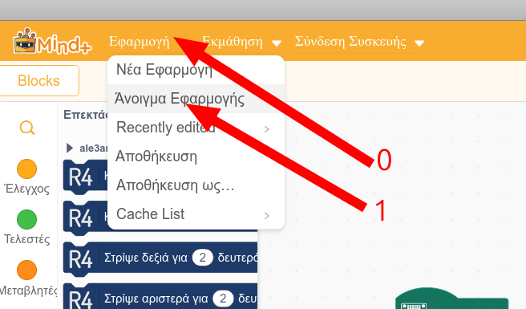
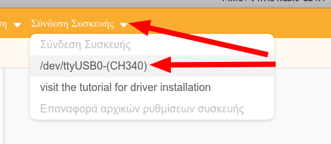
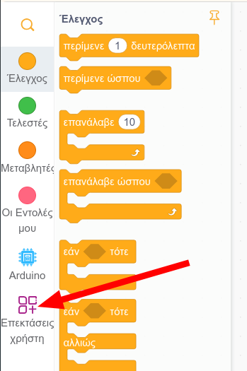

# Χρήση του πρόσθετου

(0) Κατεβάζεις ένα έργο Mind+ (saved project) από [εδώ](https://github.com/ale3andro/mindplus_ext_gigorobot/raw/refs/heads/main/latest_project_file/gigo.mp), το οποίο περιέχει ενσωματωμένο το πρόσθετο.

(1) Κατεβάζεις την εφαρμογή Mind+ από [εδώ](https://mindplus.cc/), αν φυσικά δεν την έχεις ήδη. Εναλλακτικά μπορείς να κατεβάσεις το εξαιρετικό Mind+ Custom Build του συνάδελφου Βαγγέλη Μίχα από [εδώ](https://github.com/vmihas/MindPlus-Custom-Build/releases/tag/1.1).

(2) Ξεκινάς την εφαρμογή Mind+ και μέσα από την εφαρμογή, ανοίγεις το έργο Mind+ (saved project) που κατέβασες στο βήμα (0).

(3) Συνδέεις το κιτ σε μια θύρα USB του υπολογιστή και συνδέεις μέσα από την εφαρμογή.

(4) Τα blocks με τις διαθέσιμες εντολές, βρίσκονται στην κάτω αριστερή γωνία της εφαρμογής

(5) Όταν ετοιμάσεις το σενάριο, το ανεβάζεις κάνοντας κλικ στην επιλογή **Upload**

Αποσυνδέεις το καλώδιο USB και ανοίγεις τον διακόπτη της μπαταρίας για να ξεκινήσει να τρέχει το σενάριο.

Καλή διασκέδαση!

